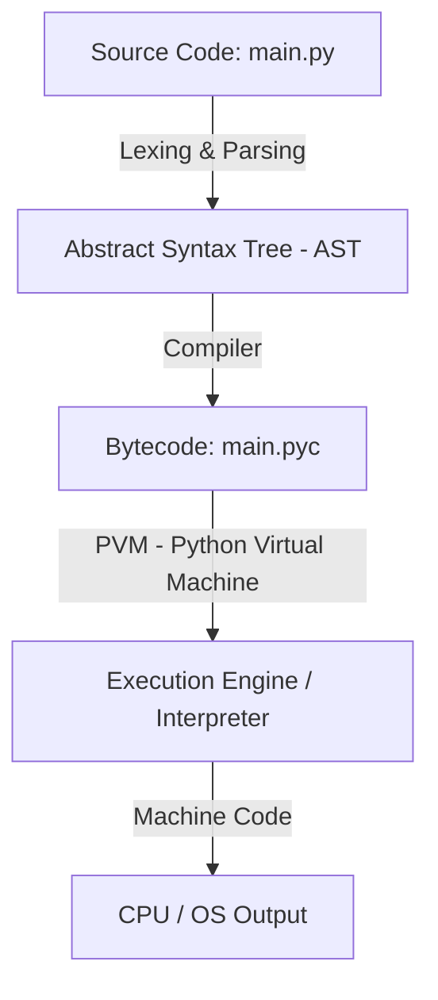

# Python Architecture, Execution & Memory Management Guide

Yeh document Python ke internal working, execution steps, compilation vs interpretation, aur memory management ko deep breakdown ke saath practical Python code examples ke saath samjhata hai.

---

## 1. Compiled vs Interpreted vs Python (Hybrid Approach)

### A. Compiled Languages (C, C++, Rust, Go)
* **Working Mechanism:** Source code poora ek baar mein **Compiler** dwara padha jata hai aur seedhe machine code (`.exe` ya binary format) mein convert ho jata hai.
* **Pros:** Processing aur Execution bohot superfast hota hai.
* **Cons:** Code platform-dependent hota hai (Windows ka binary Mac/Linux par chalna mushkil hai).

### B. Pure Interpreted Languages (Classic JavaScript, Shell Scripts)
* **Working Mechanism:** Interpreter source code ko line-by-line read karta hai aur instantly execute karta hai.
* **Cons:** Slow execution kyunki har baar run karte waqt parsing aur checking line-by-line hoti hai.

### C. Python: The Hybrid Architecture
Python na to pure compiler hai, na pure interpreter — ye **Hybrid Model** par kaam karta hai:

```
[ Source Code (.py) ] 
         │  (Compilation Step)
         ▼
[ Bytecode (.pyc) ] 
         │  (Interpretation Step via PVM)
         ▼
[ Machine Code (0s & 1s) ] ➔ CPU Execution
```

1. **Step 1 (Compilation):** Python aapke `.py` file ko low-level, platform-independent **Bytecode** (`.pyc`) mein compile karta hai.
2. **Step 2 (Interpretation):** **Python Virtual Machine (PVM)** is Bytecode ko line-by-line read karke aapke operating system / CPU ke liye Machine Code mein translate karta hai.

---

## 2. Python Execution Flow (Step-by-Step)

Jab aap terminal par command chalate ho: `python main.py`, to background mein ye steps follow hote hain:



### Explanation of Steps:

1. **Source Code (`main.py`):** Aapka original human-readable code.
2. **Lexing & Parsing:** Python pehle code ki syntax checking karta hai aur **Tokenize** karke ek **AST (Abstract Syntax Tree)** banata hai.
3. **Bytecode Compilation (`.pyc`):**
   * Code ko intermediate format (Bytecode) mein convert karta hai.
   * Jab aap koi module import karte ho, Python `__pycache__` directory mein `.pyc` file save kar leta hai taaki agli baar compilation fast ho sake.
4. **Python Virtual Machine (PVM):**
   * PVM ek runtime engine (interpreter loop) hai jo Bytecode instructions ko padhta hai aur platform-specific machine code generate karta hai.

---

## 3. Practical Example: Disassembling Python Bytecode

Python ka `dis` (Disassembler) module use karke aap dekh sakte ho ki Python aapke code ko Bytecode mein kaise convert karta hai:

```python
import dis

def add_numbers(a, b):
    result = a + b
    return result

# Disassemble function to view raw Bytecode instructions
dis.dis(add_numbers)
```

**Output (Sample Bytecode Instructions):**
```text
  4           0 LOAD_FAST                0 (a)
              2 LOAD_FAST                1 (b)
              4 BINARY_ADD
              6 STORE_FAST               2 (result)

  5           8 LOAD_FAST                2 (result)
             10 RETURN_VALUE
```

---

## 4. Memory Management in Python

Python memory management fully automated hota hai. Developer ko manual memory allocation (`malloc`) ya deallocation (`free`) nahi karni padti.

### A. Stack Memory vs Heap Memory

```
┌───────────────────────────┐      ┌───────────────────────────┐
│       STACK MEMORY        │      │        HEAP MEMORY        │
├───────────────────────────┤      ├───────────────────────────┤
│ Variable Name   Reference │      │ Address       Actual Data │
│  x -----------─┼──────────┼────► │ 0x7f8a1    ➔  100 (int)   │
│  names --------┼──────────┼────► │ 0x7f8a9    ➔  ['A', 'B']  │
└───────────────────────────┘      └───────────────────────────┘
```

* **Stack Memory:** Function calls, local variable names aur object ke references (addresses) ko store karti hai.
* **Private Heap Memory:** Python ke saare actual objects (integers, strings, lists, dictionaries, objects) Heap mein store hote hain.

---

## 5. Reference Counting Mechanism

Python mein **har object ke pass ek Reference Count hota hai** jo track karta hai ki us object ko kitne variables point kar rahe hain.

* Jab naya reference banta hai $\rightarrow$ Reference Count **+1** hota hai.
* Jab variable delete ya out of scope hota hai $\rightarrow$ Reference Count **-1** hota hai.
* Jab Reference Count **0** ho jata hai $\rightarrow$ Memory turant **Free** ho jaati hai!

### Code Example: Reference Count Check

```python
import sys

# 1. New object created
a = [10, 20, 30]
print("Initial ref count:", sys.getrefcount(a) - 1)  # Note: getrefcount adds temporary 1 ref

# 2. Assigning to another variable
b = a
print("After b = a ref count:", sys.getrefcount(a) - 1)

# 3. Deleting reference 'b'
del b
print("After del b ref count:", sys.getrefcount(a) - 1)
```

---

## 6. Garbage Collection & Cyclic References

Reference counting perfectly kaam karta hai, par ek jagah fail ho jata hai: **Cyclic References**.

### What is a Cyclic Reference?
Jab Object A Object B ko point karta hai, aur Object B Object A ko point karta hai — par koi external variable un dono ko access nahi kar sakta!

```
[ Object X ]  ◄────────►  [ Object Y ]
      ▲                         ▲
      │ (del x)                 │ (del y)
  Variables deleted, but Objects still reference each other!
```

### Python's Garbage Collector (GC)
Is problem ko solve karne ke liye Python ka **Generational Garbage Collector** (C-Python implementation) background mein chalta hai.

Python Garbage Collection 3 Generations maintain karta hai:
1. **Generation 0:** Naye bane objects yahan jate hain. GC yahan sabse frequenlty cleanup karta hai.
2. **Generation 1:** Jo objects Gen 0 cleanup se bachtey hain, wo Gen 1 mein promote hote hain.
3. **Generation 2:** Long-living objects (jaise modules, global variables) Gen 2 mein jate hain.

### Code Example: Inspecting Garbage Collector

```python
import gc

# Enable/Disable GC or inspect threshold
print("GC Enabled Status:", gc.isenabled())
print("GC Thresholds (Gen0, Gen1, Gen2):", gc.get_threshold())

# Creating a cyclic reference
class Node:
    def __init__(self, val):
        self.val = val
        self.next = None

node1 = Node(1)
node2 = Node(2)

node1.next = node2
node2.next = node1  # Cyclic link!

# Delete main variable references
del node1
del node2

# Force manual garbage collection sweep for cyclic references
unreachable_objects = gc.collect()
print(f"Unreachable objects collected by GC: {unreachable_objects}")
```

---

## 7. Key Takeaways Summary

| Feature | Description |
| :--- | :--- |
| **Language Type** | Hybrid (Compiled to Bytecode, then Interpreted via PVM) |
| **Bytecode File** | `.pyc` (Stored inside `__pycache__`) |
| **Core Engine** | PVM (Python Virtual Machine) |
| **Primary Memory Cleaner** | Reference Counting (Deletes object as soon as ref count drops to 0) |
| **Secondary Memory Cleaner**| Generational Garbage Collector (Handles Cyclic References) |
| **Memory Structure** | Variables on Stack $\rightarrow$ Reference to Objects on Private Heap |
